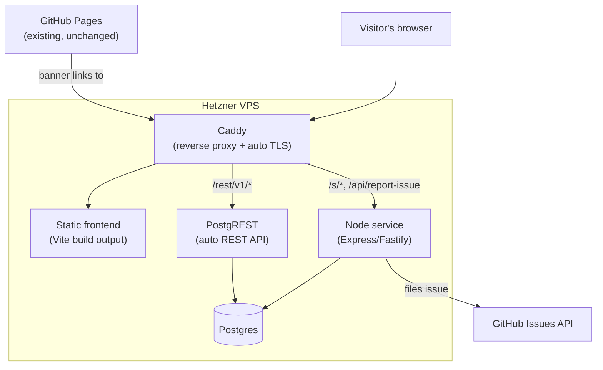

# Site Migration Implementation Plan

Moves the site off "static GitHub Pages only" onto a self-hosted setup that adds
three features: keyword-based shortened share links, anonymous issue reporting,
and cookie-less analytics with page/journey tracking. GitHub Pages keeps
running as a pointer to the new canonical site.

## Goals

- Replace the long `lz-string`-compressed `?share=` URLs with short,
  RS3-themed links like `jellyflow.xyz/Leagues/s/torva-seismic-vengeance`.
- Let visitors report site issues without a GitHub account, landing in this
  repo's GitHub Issues for triage.
- Track pageviews and visitor journeys without cookies or persistent
  identifiers, using a rotating salted hash for approximate-unique counts.
- Keep the existing GitHub Pages deployment working, with a banner pointing
  visitors at the new domain.

## Architecture overview

Everything new runs on the existing Hetzner box, via Docker.



Notably lighter than "The Garage" project's self-hosted Supabase stack: no
GoTrue (auth), no Realtime, no Storage/imgproxy, no Kong. This site has no
user accounts, no websockets, no file uploads - a plain Postgres + PostgREST
gives the same auto-REST-API-with-RLS pattern with far less running.

## Phase 1 — Server foundation

- [ ] Point the custom domain's DNS (A record) at the Hetzner box.
- [ ] Install Docker + Docker Compose on the box if not already present.
- [ ] Write a `docker-compose.yml` with three services: `postgres` (plain
      `postgres:16` image, not `supabase/postgres` - no need for its extra
      schemas/extensions), `postgrest`, and `caddy`. Reuse the Caddyfile idiom
      from `The Garage`'s `.prodserver/livekit/Caddyfile`
      (`domain { reverse_proxy service:port }`) for automatic Let's Encrypt TLS.
- [ ] Firewall: only 80/tcp and 443/tcp need to be open to the world; Postgres
      and PostgREST stay on the internal Docker network, never exposed
      directly.
- [ ] Confirm the Vite build (`npm run build`) output can be served as static
      files by Caddy from this same box.

## Phase 2 — Database schema

Three tables, all in the `public` schema so PostgREST auto-exposes them.

```sql
create table short_links (
  code        text primary key,
  payload     text not null,           -- the existing lz-string compressed build payload
  created_at  timestamptz not null default now()
);

create table issue_reports (
  id          bigint generated always as identity primary key,
  body        text not null,
  github_issue_number integer,          -- filled in after the Node service files it
  created_at  timestamptz not null default now()
);

create table page_events (
  id          bigint generated always as identity primary key,
  session_id  text not null,            -- rotating salted hash, see Phase 5
  event_type  text not null,            -- 'pageview' | custom event names
  path        text not null,
  referrer    text,
  created_at  timestamptz not null default now()
);
```

RLS policies (applied to all three tables):

- `anon` role: `INSERT` only.
- No `SELECT`/`UPDATE`/`DELETE` for `anon` - reads happen only via a direct
  Postgres client (TablePlus/DBeaver/psql) using the admin role, not through
  PostgREST's public API.
- `short_links` needs one exception: a `SELECT` policy scoped to exact-code
  lookup only (needed so the Node service, or PostgREST itself, can resolve
  a code to its payload) - never a listing/browsing query.

## Phase 3 — Node service (shortlinks + issue reporting)

A small Express/Fastify app, containerized, sitting behind Caddy for two
routes that need real HTTP semantics or a hidden secret (things PostgREST
alone can't do):

**`GET /s/:code`** (reachable at `jellyflow.xyz/Leagues/s/:code` - Caddy
strips the `/Leagues` prefix before proxying, see `deploy/Caddyfile.snippet`)
- Look up `code` in `short_links` (via PostgREST or a direct DB connection).
- Not found → 404 page. Found → `302` redirect to
  `jellyflow.xyz/Leagues/?share=<payload>#gear` (today's existing share-link
  format, unchanged) so the rest of the app doesn't need to know shortlinks
  exist.

**`POST /api/shorten`**
- Body: the same `{ regions, equippedNamesByStyle, eofWeaponNamesByStyle, relics, defaultStyle }`
  shape `encodeShareBuild` already produces.
- Pick 3 random words from `SHORTLINK_WORDS` (`src/data/shortLinkWords.js`),
  independently, repeats allowed, join with hyphens.
- Insert into `short_links`; on unique-constraint conflict, regenerate and
  retry (collision odds are ~1-in-13,400 at 3 words per the earlier
  calculation - a retry loop, not a real bottleneck).
- Return the short code to the frontend to display/copy.

**`POST /api/report-issue`**
- Body: reporter's free-text report (no auth needed).
- Basic abuse protection: per-IP rate limit, optionally Cloudflare Turnstile
  token verification.
- Uses a GitHub token (personal access token or GitHub App installation
  token, `issues:write` scope) held only in this service's environment -
  never sent to the browser - to call
  `POST /repos/{owner}/{repo}/issues` and file the report.
- Also inserts a row into `issue_reports` (optionally storing the returned
  `github_issue_number`) so there's a queryable local copy alongside the
  GitHub-side triage view.

## Phase 4 — Frontend integration

- Add a "Copy short link" action next to the existing share-link UI in
  [shareBuild.js](../src/utils/shareBuild.js)'s consumer(s) - calls
  `POST /api/shorten` and shows the returned `jellyflow.xyz/Leagues/s/<code>`
  URL.
- Add a "Report an issue" form/modal - calls `POST /api/report-issue`.
- No change needed to `decodeShareBuild`/`parseShareParam` - shortlinks
  resolve server-side into the exact same `?share=` URL shape the app
  already parses.

## Phase 5 — Analytics (cookie-less, page/journey tracking)

- **Session identity without cookies**: derive `session_id` as
  `HMAC(daily_salt, ip + user_agent)`. The salt rotates daily and is never
  stored alongside raw IPs - this gives approximate unique-visitor counts
  (the same technique Plausible/Fathom/Cloudflare Analytics use) without any
  persistent client-side identifier.
- **Journey tracking**: the frontend fires a `POST` to `page_events` (via
  PostgREST, insert-only) on every hash-route change (`AppContent`'s existing
  `hashchange` listener in [App.jsx](../src/App.jsx) is already the right
  hook point) with `{ session_id, event_type: 'pageview', path, referrer }`.
  Custom events (e.g. "shortlink created", "issue reported") can reuse the
  same table with a different `event_type`.
- Reconstructing a visitor's path through the site is then a `GROUP BY
  session_id ORDER BY created_at` query - no dashboard needed at first, a
  direct SQL query against Postgres is enough to start.

## Phase 6 — Domain and GitHub Pages

- Add a banner to the existing GitHub Pages build (the `main` branch's
  deployed site, unchanged workflow) pointing at the new custom domain as
  the canonical/primary site.
- No changes to `.github/workflows/deploy.yml` - GitHub Pages keeps
  deploying exactly as it does today.

## Phase 7 — Security checklist before going live

- [ ] Confirm `anon` role RLS policies are insert-only (plus the narrow
      exact-code `SELECT` on `short_links`) - verify by attempting a listing
      query with the anon key and confirming it's rejected.
- [ ] GitHub token stored as an environment variable on the Node service
      only, never committed, never sent to the browser.
- [ ] Rate limiting (and optionally Turnstile) on `/api/report-issue` and
      `/api/shorten` to prevent spam/abuse of the two public write endpoints.
- [ ] Caddy auto-TLS confirmed working (valid cert, auto-renewal) before
      pointing the real domain at it.
- [ ] Daily-rotating salt for the analytics session hash is generated
      server-side and never exposed to the client.

## Open items to decide during implementation

- Exact wording/placement of the GitHub Pages redirect banner.
- Whether `issue_reports` needs any admin-facing view beyond direct DB
  access, or GitHub Issues alone is sufficient for triage.
- Whether analytics needs any aggregated reporting UI, or ad-hoc SQL queries
  are enough for now.
